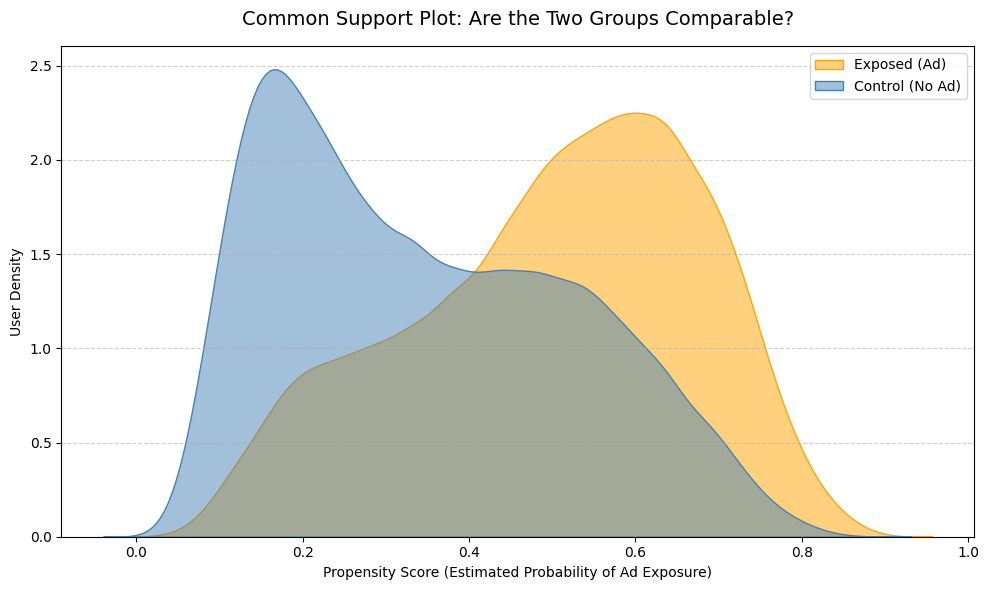
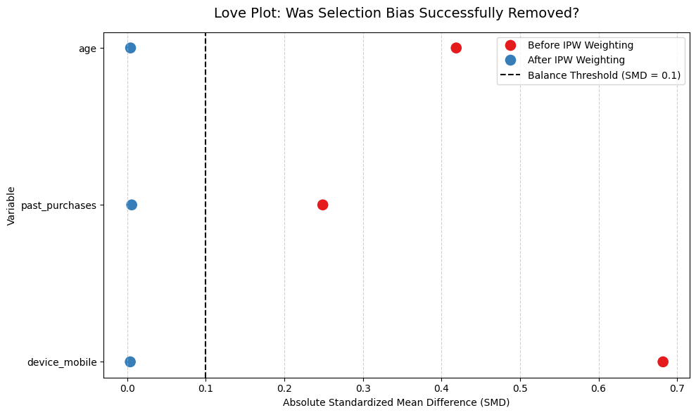

# Causal Impact of Ad Exposure on Conversion Rate
### Measuring the True Incremental Lift of Advertising Using Inverse Probability Weighting (IPW)

---

## The Business Question

**Do ads actually drive conversions — or do we just happen to show them to users who would have converted anyway?**

This is one of the most common measurement traps in marketing analytics. A naive comparison of conversion rates between exposed and non-exposed users will almost always overestimate the true impact of advertising, because the two groups are not comparable to begin with.

This project addresses that problem using a causal inference approach: **Inverse Probability Weighting (IPW)**.

---

## The Problem: Selection Bias

Users who are exposed to ads are not randomly selected. They tend to be:
- Younger
- More active (more past purchases)
- More likely to browse on mobile

These characteristics independently increase the likelihood of converting. If we simply compare conversion rates, we are measuring **user quality**, not **ad effectiveness**.

> A junior analyst reports: *"Users who saw the ad converted 12% more."*  
> The real question is: *"Would they have converted anyway?"*

---

## The Solution: Inverse Probability Weighting (IPW)

IPW is a causal inference technique that re-weights observations to create a statistically balanced comparison between the two groups — as if ad exposure had been randomly assigned.

**How it works:**

1. **Estimate the Propensity Score (PS):** the probability that each user was exposed to the ad, given their observable characteristics (age, device, past purchases), using Logistic Regression.

2. **Apply IPW weights:**
   - Exposed users unlikely to see the ad → upweighted (`1 / PS`)
   - Control users likely to see the ad → upweighted (`1 / (1 - PS)`)

3. **Compute the weighted conversion rate** for each group — this removes the confounding effect of user characteristics.

4. **Validate balance** using Standardized Mean Differences (SMD) before and after weighting.

---

## Validation: Did It Work?

### Common Support Plot

Before drawing any causal conclusions, we verify that both groups share a comparable range of propensity scores. If the distributions had no overlap, the comparison would be invalid.



> **Reading this plot:** The overlap between the two curves confirms that both groups contain users with similar characteristics. The IPW comparison is statistically valid.

---

### Love Plot — Covariate Balance (SMD)

The Love Plot shows the Standardized Mean Difference (SMD) for each covariate before and after IPW weighting. An SMD below **0.1** is the conventional threshold for adequate balance.



> **Reading this plot:** All three covariates (age, past purchases, device) fall well below the 0.1 threshold **after IPW weighting** (blue dots), confirming that selection bias has been successfully removed. Before weighting (red dots), the groups were substantially imbalanced — especially on `device_mobile` and `age`.

---

## Results

| Metric | Value |
|--------|-------|
| Raw Conversion Rate — Control | 10.78% |
| Raw Conversion Rate — Exposed | 16.83% |
| **Raw Lift (unadjusted)** | 6.05% |
| Causal CR — Control (IPW) | 11.28% |
| Causal CR — Exposed (IPW) | 16.45% |
| **True Causal Lift (IPW-adjusted)** | 5.17% |
| **Overestimation bias** | 0.89 pp |

> The difference between raw lift and causal lift represents the portion of observed uplift that was driven by **user characteristics**, not the ad itself. Reporting the raw number to a marketing team would lead to overspending on a channel whose true incremental value is lower than it appears.

---

## Key Takeaways

- **Raw conversion rate comparisons are biased** when treatment is not randomly assigned — which is almost always the case in digital advertising.
- **IPW successfully balanced the groups**, as confirmed by the Love Plot (all SMDs < 0.1 after weighting).
- **The true causal lift is lower than the raw lift**, meaning a portion of the observed conversion uplift was attributable to pre-existing user characteristics.
- This methodology is directly applicable to real-world scenarios: paid social campaigns, display advertising, email targeting, and any context where the marketer cannot run a pure A/B test.

---

## Tools & Methods

| Tool | Purpose |
|------|---------|
| `pandas` | Data loading and manipulation |
| `scikit-learn` | Logistic Regression for propensity score estimation |
| `numpy` | SMD calculation and weighted statistics |
| `matplotlib` / `seaborn` | Visualisation (Common Support Plot, Love Plot) |

**Methodology:** Inverse Probability Weighting (IPW) — a standard technique in causal inference, widely used in epidemiology, economics, and marketing measurement.

---

## Project Structure

```
causal_marketing_project/
│
├── data/
│   └── synthetic_marketing_data.csv   # Synthetic dataset
│
├── analysis.ipynb                     # Full analysis notebook
├── common_support_plot.png            # Validation plot 1
├── love_plot.png                      # Validation plot 2
└── README.md                          # This file
```

---

## About

Built as a portfolio project to demonstrate applied causal inference in a marketing analytics context.  
The dataset is synthetic. The methodology is production-ready.

*Currently deepening Python skills — this project was built to understand and apply causal thinking to real marketing measurement problems.*
